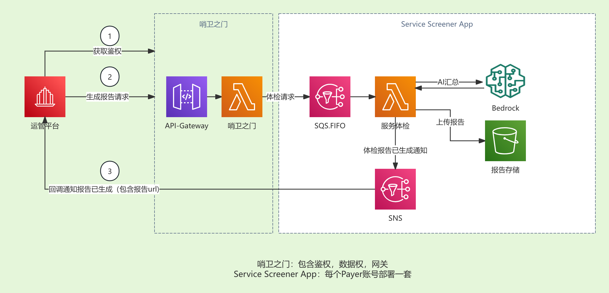
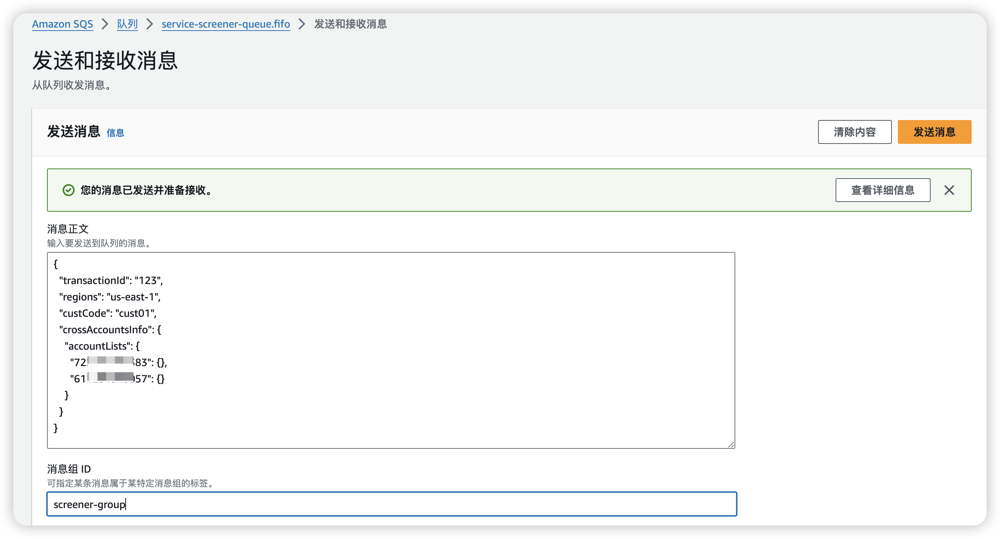
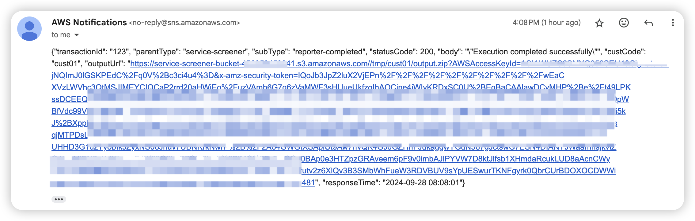
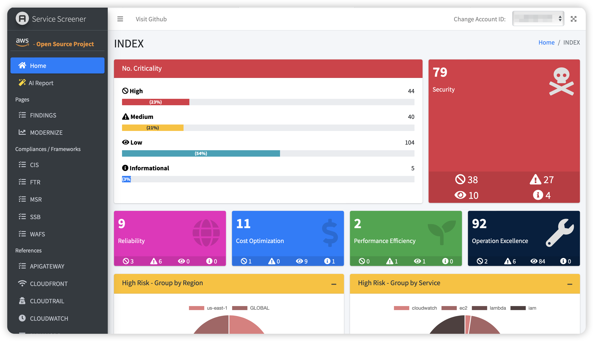

# Welcome to your CDK service-screener-v2 project

基于AWS现代化架构的六大支柱，对AWS服务做审计，并通过AI做报告汇总



## Installing
### 配置

在项目目录下创建.env文件

配置范例如下
```
# 项目相关设置--保存报告输出文件的目录
DIR_PREFIX=/tmp

# AWS Bedrock相关设置
AWS_AK=123
AWS_SK=123
AWS_REGION_CODE=us-west-2
AWS_BEDROCK_CLAUDE_SONNET=anthropic.claude-3-haiku-20240307-v1:0
AWS_AI_MOCK=false
# AWS_BEDROCK_CLAUDE_SONNET=anthropic.claude-3-sonnet-20240229-v1:0
```
⚠️如果没有bedrock环境，可以把AWS_AI_MOCK设置为true
### 安装命令
```
# 构建lambda layer
./package_lambda_layer.sh
# deploy this stack to your default AWS account/region
cdk deploy
```
## 运行测试
1.发送请求到sqs队列



简单请求范例
```
{
  "transactionId": "123",
  "regions": "us-east-1",
  "custCode": "cust01",
  "crossAccountsInfo": {
    "accountLists": {
      "123123238899": {},
      "124124848323": {}
    }
  }
}
```
这里面执行的环境需要对体检的帐号要有权限，这里采用默认角色，更多[参数说明](param.md)

2.服务体检报告处理后，发送消息到sns，比如在sns上配置邮件订阅，或者http订阅

通过消息上的url下载报告

3.报告范例页面如下
